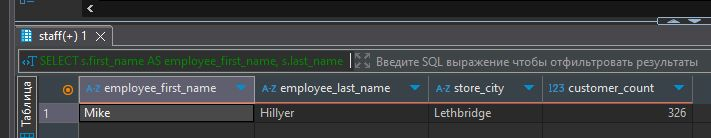
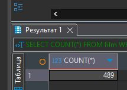
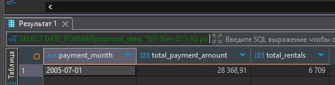
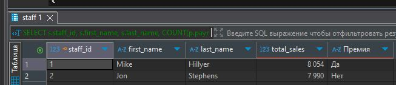
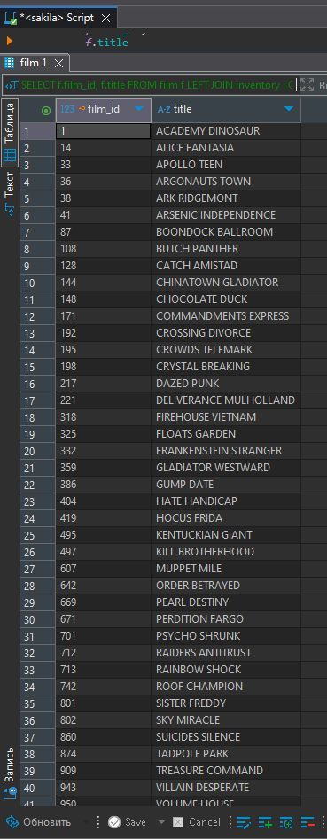

# Домашнее задание к занятию "`SQL. Часть 2`" - `Лебедев Виктор`


### Инструкция по выполнению домашнего задания

   1. Сделайте `fork` данного репозитория к себе в Github и переименуйте его по названию или номеру занятия, например, https://github.com/имя-вашего-репозитория/git-hw или  https://github.com/имя-вашего-репозитория/7-1-ansible-hw).
   2. Выполните клонирование данного репозитория к себе на ПК с помощью команды `git clone`.
   3. Выполните домашнее задание и заполните у себя локально этот файл README.md:
      - впишите вверху название занятия и вашу фамилию и имя
      - в каждом задании добавьте решение в требуемом виде (текст/код/скриншоты/ссылка)
      - для корректного добавления скриншотов воспользуйтесь [инструкцией "Как вставить скриншот в шаблон с решением](https://github.com/netology-code/sys-pattern-homework/blob/main/screen-instruction.md)
      - при оформлении используйте возможности языка разметки md (коротко об этом можно посмотреть в [инструкции  по MarkDown](https://github.com/netology-code/sys-pattern-homework/blob/main/md-instruction.md))
   4. После завершения работы над домашним заданием сделайте коммит (`git commit -m "comment"`) и отправьте его на Github (`git push origin`);
   5. Для проверки домашнего задания преподавателем в личном кабинете прикрепите и отправьте ссылку на решение в виде md-файла в вашем Github.
   6. Любые вопросы по выполнению заданий спрашивайте в чате учебной группы и/или в разделе “Вопросы по заданию” в личном кабинете.
   
   Желаем успехов в выполнении домашнего задания.

---

---

Задание можно выполнить как в любом IDE, так и в командной строке.

### Задание 1

Одним запросом получите информацию о магазине, в котором обслуживается более 300 покупателей, и выведите в результат следующую информацию: 
- фамилия и имя сотрудника из этого магазина;
- город нахождения магазина;
- количество пользователей, закреплённых в этом магазине.

---

### Решение 1

Запрос
```
SELECT
    s.first_name AS employee_first_name,
    s.last_name AS employee_last_name,
    ci.city AS store_city,
    COUNT(c.customer_id) AS customer_count
FROM
    store st
JOIN
    staff s ON st.store_id = s.store_id
JOIN
    address a ON st.address_id = a.address_id
JOIN
    city ci ON a.city_id = ci.city_id
LEFT JOIN
    customer c ON st.store_id = c.store_id
WHERE st.store_id IN (SELECT store_id FROM customer GROUP BY store_id HAVING COUNT(*) > 300)
GROUP BY
    st.store_id, s.first_name, s.last_name, ci.city;
```


---

### Задание 2

Получите количество фильмов, продолжительность которых больше средней продолжительности всех фильмов.

---

### Решение 2

Запрос
```
SELECT COUNT(*)
FROM film
WHERE length > (SELECT AVG(length) FROM film);
```

---

### Задание 3

Получите информацию, за какой месяц была получена наибольшая сумма платежей, и добавьте информацию по количеству аренд за этот месяц.

---

### Решение 3

Запрос
```
SELECT
    DATE_FORMAT(payment_date, '%Y-%m-01') AS payment_month,
    SUM(amount) AS total_payment_amount,
    COUNT(payment.rental_id) AS total_rentals  
FROM
    payment
JOIN
    rental ON payment.rental_id = rental.rental_id
GROUP BY
    payment_month
ORDER BY
    total_payment_amount DESC
LIMIT 1;
```

---

### Задание 4*

Посчитайте количество продаж, выполненных каждым продавцом. Добавьте вычисляемую колонку «Премия». Если количество продаж превышает 8000, то значение в колонке будет «Да», иначе должно быть значение «Нет».

---

### Решение 4

Запрос
```
SELECT
    s.staff_id,
    s.first_name,
    s.last_name,
    COUNT(p.payment_id) AS total_sales,
    CASE
        WHEN COUNT(p.payment_id) > 8000 THEN 'Да'
        ELSE 'Нет'
    END AS Премия
FROM
    staff s
LEFT JOIN
    payment p ON s.staff_id = p.staff_id
GROUP BY
    s.staff_id, s.first_name, s.last_name
ORDER BY
    total_sales DESC;
```

---

### Задание 5*

Найдите фильмы, которые ни разу не брали в аренду.

---

### Решение 5*

Запрос
```
SELECT
    f.film_id,
    f.title
FROM
    film f
LEFT JOIN
    inventory i ON f.film_id = i.film_id
LEFT JOIN
    rental r ON i.inventory_id = r.inventory_id
WHERE
    r.rental_id IS NULL;
```

---


Задания,помеченные звёздочкой, — дополнительные, то есть не обязательные к выполнению, и никак не повлияют на получение вами зачёта по этому домашнему заданию. Вы можете их выполнить, если хотите глубже разобраться в материале.
